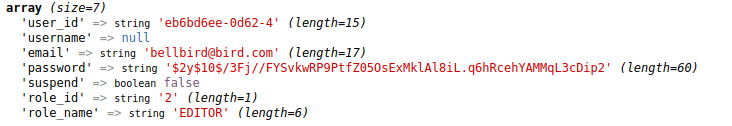
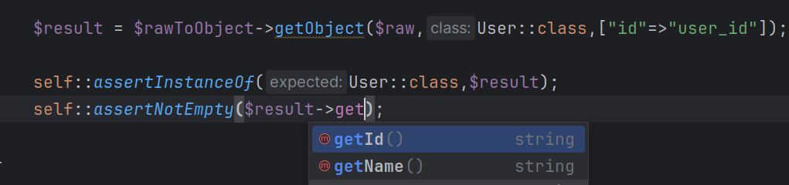

## SIMPLE RAW MAPPER TO OBJECT

---

Is a library for extracting raw result from database to an object.
This library will help you for get suggestion and mapping to object,
and say goodbye to **writing mistake**.

```php
$object['use_id']
=> No array key with 'use_id'
```


Ex raw result :



Ex suggestion result :




